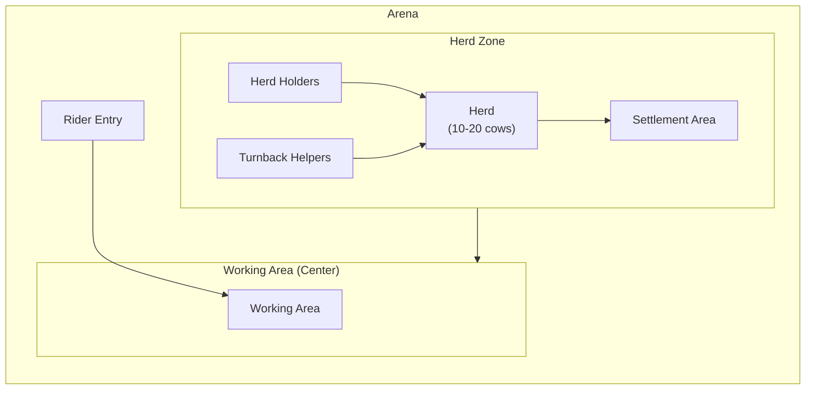
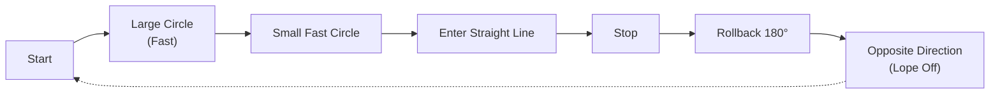
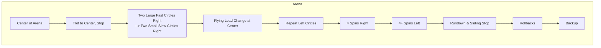
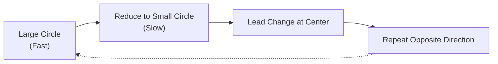
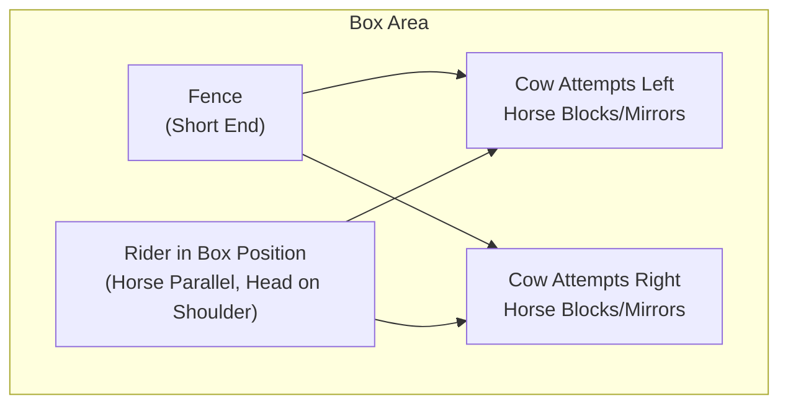
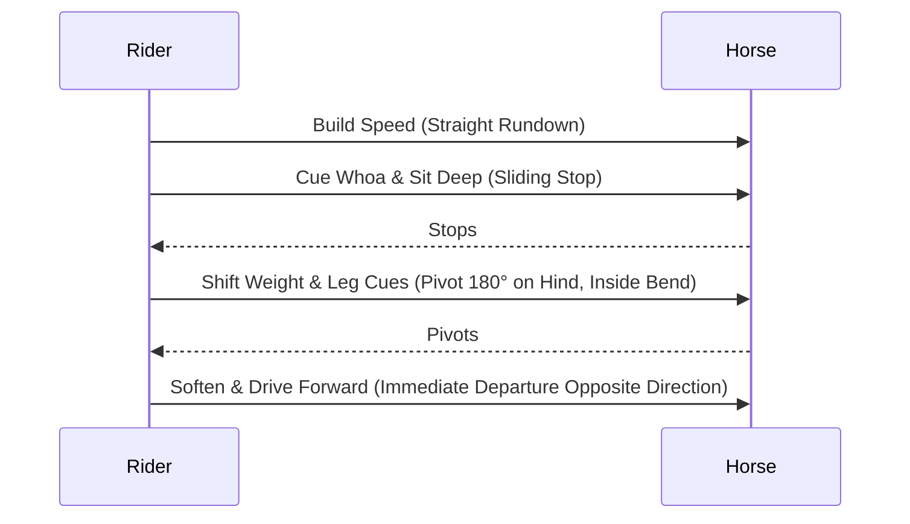

# Beginner's Guide to Preparing for AQHA Versatility Ranch Horse (VRH) Events

#### Table of Contents
- Introduction
- Ranch Cutting
- Ranch Reining
- Boxing (Ranch Cow Work Foundation)
- Rollbacks: Proper Cues and Technique
- Final Tips for Show Prep
- References

## Introduction
Welcome to the world of Versatility Ranch Horse (VRH) competitions! AQHA VRH events showcase the all-around abilities of ranch horses through classes like ranch riding, trail, reining, cow work, **cutting**, and conformation. This guide is tailored for horsemen new to showing, focusing on three key cow-related classes: **Ranch Cutting**, **Ranch Reining**, and **Boxing** (the foundational phase of ranch cow work, ideal for beginners or limited divisions).

The goal is to build confidence, cow sense, and precision through progressive exercises. Start with dry work (no cattle), then introduce fresh cattle gradually. Practice 4–5 days a week, 30–60 minutes per session, focusing on softness, responsiveness, and rewarding your horse. Always prioritize safety—use helpers for herd work and fresh, workable cattle.

## Ranch Cutting
Ranch Cutting tests your horse's ability to separate (cut) one or two cows from a herd and hold them away, demonstrating natural cow sense and control. In VRH, open/amateur divisions typically require working two cows in 2 minutes. Riders can cue with reins, unlike pure cutting.

**Key Skills Needed**: Reading cattle, quick stops, turns mirroring the cow, staying in position (horse's head on cow's shoulder).

**Arena Setup Diagram** (Typical Ranch Cutting Layout):

**Exercises to Practice (Progress from Dry to Live Cattle)**:
1. **Dry Work: Body Control Drills**  
   Build responsiveness without cattle.  
   - Lope large circles, then small circles with speed changes.  
   - Practice rollbacks and stops: Lope straight, stop hard, rollback 180°.  
   - Counter-arc circles: Bend horse opposite direction of travel to loosen ribs.  

   **Diagram of Circle-Stop-Rollback Drill**:

2. **Flag/Mechanical Cow Work**  
   Use a flag or mechanical cow for simulated cutting. Practice dropping into cow position, mirroring movements.

3. **Live Cattle Introduction**  
   Start with settled cows. Commit to one cow, drive it deep into herd to cut, then hold it in center. Practice 2–3 cuts per session, quitting on a good note.

4. **Full Runs**  
   Time yourself (2 minutes), cut two cows. Focus on clean commits and holding without excessive cuing.

Aim for 20–30 sessions before showing. Watch cattle behavior to anticipate moves.

## Ranch Reining
Ranch Reining evaluates reining maneuvers adapted for ranch versatility: circles, spins, stops, rollbacks, lead changes, and backups. There are 7 official AQHA patterns—memorize and practice them exactly.

**Key Skills Needed**: Guide (minimal hands), speed control, precise markers.

**Example Pattern Diagram** (VRH Ranch Reining Pattern 1 Simplified):

**Exercises to Practice**:
1. **Breakdown Maneuvers**  
   - Circles: Large fast/small slow, maintaining cadence.  
   - Spins: Start slow, build to 4+ revolutions with consistent speed.  
   - Stops: Rundowns from lope, slide 10–15 feet.  

   **Drill Diagram: Circle-Speed Transition**:

2. **Pattern Sections**  
   Practice half-patterns, then full. Video yourself for accuracy.

3. **Transitions**  
   50 walk-lope-walk transitions per ride for softness.

4. **Full Pattern Runs**  
   Ride random patterns daily. Add hesitation at center for show realism.

Practice patterns in order; judges look for ranch practicality over flash.

## Boxing (Ranch Cow Work Foundation)
Boxing is the entry-level cow phase: Hold/control a single cow at one end of the arena for 50 seconds (rookie/limited) or as part of full cow work. Great for beginners—no fence turns required.

**Key Skills Needed**: Position on cow, rate control, quiet dominance.

**Boxing Phase Diagram**:

**Exercises to Practice**:
1. **Dry Work Prep**  
   Shadowbox an imaginary cow: Lope straight, stop, lateral moves to "block."

2. **Flag Work**  
   Have helper move flag like a cow; practice holding position.

3. **Single Cow Boxing**  
   - Call for fresh cow, box at end for 50 seconds.  
   - Focus: Stay ahead of cow, loose rein, horse reads independently.

4. **Progression Drills**  
   - Box, then drive short distance and re-box (for limited cow work).  
   - Use hay bale as "cow" for position practice.

Time sessions; reward quiet control. This builds cow reading for advanced classes.

## Rollbacks: Proper Cues and Technique
Rollbacks are a key maneuver in ranch reining and cow work, involving a sliding stop followed by a 180-degree pivot on the hindquarters and immediate departure in the opposite direction. They demonstrate athleticism, balance, and responsiveness. In VRH, rollbacks should be smooth, forward, and executed with minimal rein contact—judges penalize excessive pulling or hesitation.

**Key Skills Needed**: Straight rundown, engaged hindquarters, quick pivot without hopping, and forward momentum post-turn.

**Proper Technique**:
- **Setup**: Build speed in a straight rundown at a lope or gallop, keeping the horse straight and collected.
- **Stop Cue**: Sit deep in the saddle, say "whoa," and apply light, even rein pressure if needed (avoid yanking).
- **Pivot Cue**: As the horse stops, shift your weight slightly to the outside seat bone, apply inside leg at the girth to bend, and outside leg behind the girth to drive the hindquarters around.
- **Release and Go**: Soften reins immediately after the 180-degree turn, cue forward with seat and legs for a clean departure.
- **Common Mistakes to Avoid**: Leaning forward (unbalances horse), pulling too hard (causes bracing), or allowing the front end to pivot instead of the hind.

**Rollback Diagram** (Sequence View):

**Exercises to Practice**:
1. **Dry Work Basics**: At a walk, practice 180-degree turns on hindquarters (haunches-in) to build suppleness.
2. **Stop-and-Pivot Drills**: Lope straight 50 feet, stop, rollback, and lope off. Repeat 10–15 times per direction.
3. **Fence-Assisted**: Use arena fence to guide straight rundown; stop near fence, rollback away.
4. **Progressive Speed**: Start slow, increase to full speed as horse anticipates cleanly. Video for straightness.

Practice 20–30 rollbacks per session, rewarding softness. This maneuver ties into reining patterns and cow turns.

## Final Tips for Show Prep
- Warm up thoroughly: Walk/trot loose, then maneuvers.
- Show mindset: Breathe, stay centered, reward good efforts.
- Resources: AQHA Handbook, patterns at aqha.com, clinics.
- Start in rookie/limited divisions for modified rules.

With consistent practice, you'll gain the experience needed to succeed in VRH. Good luck—enjoy the ride!

## References
- [Horseman’s Guide: Fixing the “Attitude” or Mini-Buck at the Lope Departure](https://simplexvia.com/horseman/lope-attitude-fix-guide.html)
- [Guide to Versatility Ranch Horse (VRH)](https://simplexvia.com/horseman/show-guide-vrh.html)
- [Guide to Reined Cow Horse](https://simplexvia.com/horseman/show-guide-rch.html)
- [AQHA Official Handbook and Patterns](https://www.aqha.com/handbook)
- [NRCHA Rule Book](https://www.nrcha.com/rule-book/)