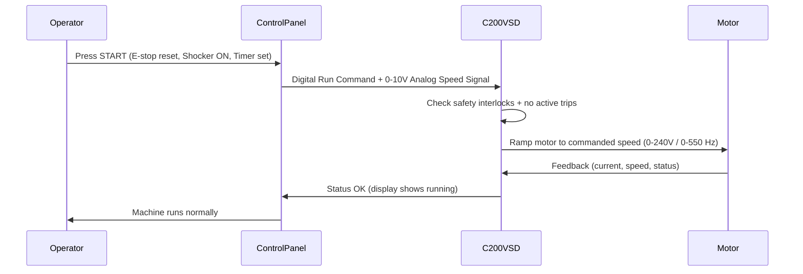
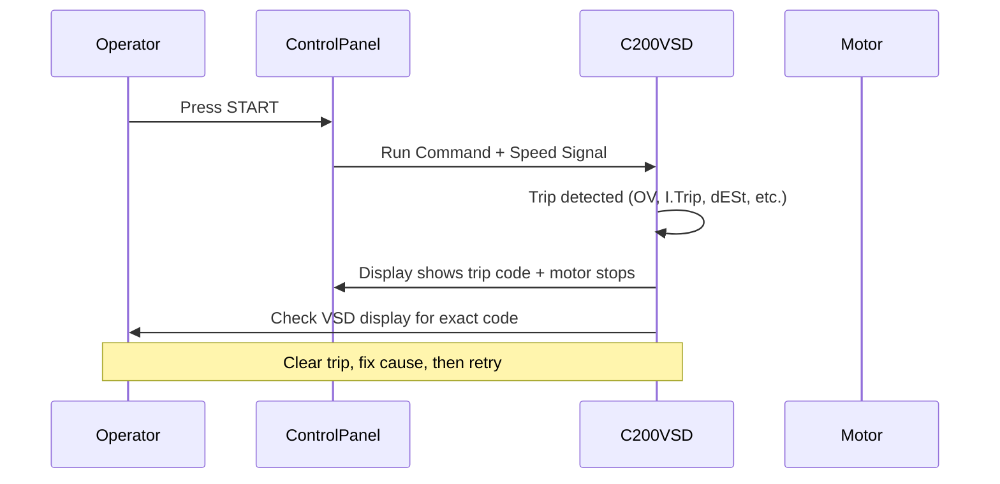

**Triage Guidance Document**  
**Centaur Free Flow Exerciser –**  
**Version 1.9** | April 8, 2026  

**The Simple Path to AI & Digital Success.**  
**SimplexVia LLC** – Research support

---

### Purpose
This document provides **quick, safe triage steps** for barn staff when the Centaur Free Flow Exerciser does **not** start, stop, or operate correctly using the **factory-original white/gray control panel**.  

---

### 1. Safety First – Never Bypass These
- **Physical E-stop** must be pulled out (reset) before anything works.  
- Shocker **must** be ON before the walker will start **during normal horse exercise sessions**.  
- **Horses must be attached before turning the machine on for normal daily operation and exercise sessions.**  
- Never change direction while the walker is moving.  
- Minimum 10-minute timer required for each horse exercise session.

**Important Clarification on Testing**  
The machine **can** be safely tested and run **empty (with no horses attached)** for troubleshooting, maintenance, commissioning, or verifying repairs. Empty testing is allowed and recommended.

**Recommended Safe Empty-Test Procedure**  
1. Ensure the arena/fence area is completely clear of people and objects.  
2. Reset the red E-stop button (pull firmly).  
3. Turn the shocker switch **OFF** (not needed for empty test).  
4. **Set the timer to 2–5 minutes** (this is allowed and safe for empty testing).  
5. Select Forward or Reverse.  
6. Press and hold the green START button.  
7. Observe arm movement, listen for unusual noises, and test speed control while running.

**Note on Timer Minimum**  
The 10-minute minimum in the Centaur manual (pages 28–30) applies **only** to normal horse exercise sessions. It does **not** apply to empty test runs. The mechanical timer and Commander C200 VSD allow any duration (including 2–5 minutes) when no horses are attached.

---

### 2. Quick Triage Checklist (Do This First – 60 Seconds)
1. **Power** – Is the main power switch ON and the machine plugged in?  
2. **E-stop** – Pull out the red mushroom button (it must click and stay out).  
3. **Shocker** – Turn the shocker switch to **ON** (for normal use).  
4. **Timer** – Set the timer for at least **10 minutes** (or more).  
5. **Direction** – Make sure Forward or Reverse is selected.  
6. **Start button** – Press and hold the green START button for 2–3 seconds.

If it still does **not** run → go to Step 3 and check the VSD.

---

### 3. Commander C200 VSD – How It Fits into the System
The original control panel does **not** directly power the motor. It sends simple signals to the **Commander C200 Variable Speed Drive (VSD)**, which then controls the 3-phase motor.

**System Flow**  
Control Panel (switches, speed knob, timer, E-stop, shocker)  
↓ (digital on/off + 0–10 V analog speed signal)  
**Commander C200 VSD** (green box inside control enclosure)  
↓ (precise variable voltage & frequency 0–240 V, 0–550 Hz)  
Motor & mechanical arms

**Firmware in the System**  
- Original control panel switches and timer: **100 % analog / electromechanical** – no firmware.  
- Commander C200 VSD: **Contains embedded firmware** (software version typically V01.xx). The firmware handles speed control, ramping, protection, and all trip logic.

**No WiFi Capability**  
The base C200 model has **no built-in WiFi or Bluetooth**. It uses only wired connections (Modbus RTU, optional plug-in modules). You must be physically at the machine to read diagnostics.

---

### 4. How to Get Output from the Commander C200
1. Power the machine ON (E-stop pulled out).  
2. Open the control box (power OFF first, then re-energize safely).  
3. Look at the **small display + keypad** on the front of the green C200 unit.  
4. The screen will show current status/speed or a **trip code**.  
5. Use the arrow keys to view trip history, parameters, and real-time motor data.

**Common Trip Codes** (see full table in References)  
- **OV** – Over voltage  
- **I.Trip / OC** – Over current / motor overload  
- **dESt** – Parameter conflict  
- **UU** – Under voltage  
- **O.Ld** – Overload

---

### 5. Triage Flow (Updated with VSD)

**Symptom → Action**  
**Machine has no power / completely dead** → Check barn breaker + confirm C200 display lights up.  
**E-stop light is on or machine will not start** → Reset red E-stop + check VSD display for trip.  
**Starts for a second then stops** → Check shocker + **read VSD trip code**.  
**Speed does not change or is erratic** → Turn speed knob while running + check VSD display.  
**Will not change direction** → Full stop first + confirm VSD receives direction command.  
**Control panel buttons feel unresponsive** → Check wiring to VSD + read VSD display.

---

### 6. Common Problems & Fixes Table (Updated)

| Symptom                          | Most Likely Cause                     | Fix (Panel + VSD)                          | Ref. |
|----------------------------------|---------------------------------------|--------------------------------------------|------|
| Nothing happens                  | E-stop or no power to VSD             | Pull E-stop + check VSD power              | p. 28 |
| Starts then immediately stops    | Shocker OFF or VSD trip               | Turn shocker ON + read VSD display         | p. 29 |
| Speed does not increase          | Speed knob / VSD analog input         | Turn knob + check VSD trip                 | p. 30 |
| Intermittent power               | Loose wire or VSD input               | Tighten terminals + check VSD supply       | — |
| Erratic / sudden stop            | VSD trip (OV, I.Trip, etc.)           | Read and clear VSD trip code               | VSD Guide |
| Buttons do not respond           | Wiring to VSD or VSD fault            | Check wiring + VSD display                 | — |

---

### 7. When to Stop & Call for Service
Call your technician immediately if:
- VSD shows a persistent trip that will not clear after reset.  
- You smell burning or hear grinding from motor/gearbox.  
- The C200 display is blank or damaged.  
- You have tried the checklist twice with no success.

**Lock-Out / Tag-Out (LOTO)** before any internal work.

---

### 8. Quick Reference – Original Equipment Workflows
- Horses **always** attached **before** powering on **for normal exercise sessions**.  
- Speed **can** be adjusted while moving.  
- Direction change **only** when fully stopped.  
- Shocker **must** stay ON during entire session.  
- Minimum 10-minute sessions.

---

### 9. How to Read and Clear Trips on the Commander C200 (Pages 147–148)
According to the **Commander C200/C300 Control User Guide** (pages 147–148), the drive stores the **last 10 trips** in non-volatile memory and displays them on the built-in keypad.

**Step-by-step procedure to read trips**:

1. Ensure the machine is powered ON and the E-stop is pulled out (display must be lit).  
2. On the C200 keypad, press the **Trip** key (or navigate to Menu 0 → Status → Trip log).  
3. The display will show the **most recent trip** first (e.g., “OV” or “I.Trip”).  
4. Use the **Up / Down arrows** to scroll through the trip history (Trip 1 = most recent, Trip 10 = oldest).  
5. For each trip the display also shows:
   - Trip code  
   - Time stamp (when the trip occurred)  
   - The parameter number that triggered the trip (if applicable)  

**To clear a trip** (page 148):  
- Press the red **STOP / RESET** key once.  
- If the trip does not clear, power cycle the entire machine (turn main power OFF for 10 seconds, then back ON).  
- The drive will only allow a start after the trip is cleared.

**Important note from manual (p. 147)**:  
Trips are **latched** for safety. The drive will not run until the fault is acknowledged and cleared. Always record the exact trip code before clearing it.

---

### 10. References

**Manuals & Hyperlinks**  
- Centaur Free Flow Exerciser Service Manual (pages 28–30):  
  [Download PDF](https://equinecisers.com/site/wp-content/uploads/FREE-FLOW-EXERCISER-SERVICE-MANUAL-INSTALLATION-DIAGRAMS.pdf)  
- Commander C200/C300 Control User Guide (full manual, trip codes, parameters):  
  [Download PDF](https://moen.nidec.com/drives/-/media/Project/Nidec/ControlTechniques/Documents/Technical/Control-User-Guides/Commander-C/Commander-C200-C300-Control-User-Guide-EN.pdf)  
- Nidec / Control Techniques Drives Services & Downloads:  
  [moen.nidec.com/drives/services](https://moen.nidec.com/drives/services)  
- Commander C200 Parameter Reference & Trip Code List:  
  [ctmanuals.info (search “Commander C200”)](https://ctmanuals.info)  
- **Connect Drive Commissioning Software** (free PC tool):  
  [Download Connect Software](https://moen.nidec.com/en-US/drives/Products/Software/Commissioning/Connect)

**Mermaid Sequence Diagrams**

**Normal Start Flow**

**Fault/Trip Path**

**Commander C200 / C300 VSD Trip Codes Table**  
(Extracted from *Commander C200/C300 Control User Guide*, primarily Chapter 12 Diagnostics, pages 147–168)

| Code       | Description                                      | Possible Causes                                      | Page Reference |
|------------|--------------------------------------------------|------------------------------------------------------|----------------|
| OV         | Over voltage                                     | Supply too high, insufficient deceleration, braking issues | 159 |
| OI.AC      | Instantaneous output over current                | Short circuit, motor insulation fault, long cable    | 158–159 |
| OI.br      | Braking IGBT over current                        | Brake resistor wiring/value fault                    | 158 |
| dESt       | Two or more parameters writing to same destination | Parameter conflict (Menus 7, 8, 9, 12, 14)         | 153 |
| I.Trip / OC| Over current / motor overload                    | Motor overload, short circuit                        | 158 |
| UU         | Under voltage                                    | Low supply voltage                                   | — |
| O.Ld       | Overload                                         | Excessive load or prolonged high current             | 156 |
| Et         | External trip                                    | External safety input activated                      | 154 |
| th         | Motor thermistor over-temperature                | Motor overheating, faulty thermistor                 | 164 |
| FAn.F      | Fan fail                                         | Fan obstructed or failed                             | 154 |
| PAd        | Keypad removed while in keypad mode              | Keypad disconnected during operation                 | 160 |
| SCL        | Control word watchdog timeout                    | Control word not serviced within 1 second            | 163 |
| HFxx       | Hardware faults (HF01–HF19)                      | Control/power PCB failure                            | 154–156 |
| C.xx       | NV Media Card / cloning trips                    | Card errors, read-only, mismatch                     | 149–151 |
| SL.xx      | Option module trips (slot 1)                     | Option module fault or removed                       | 163–164 |